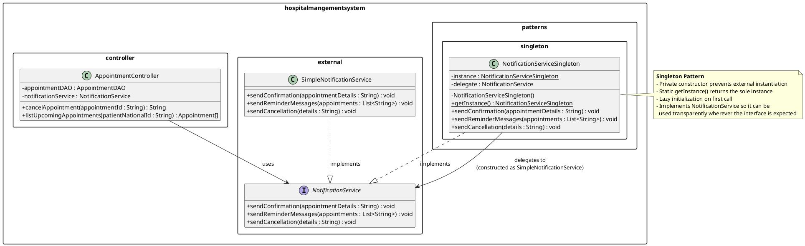
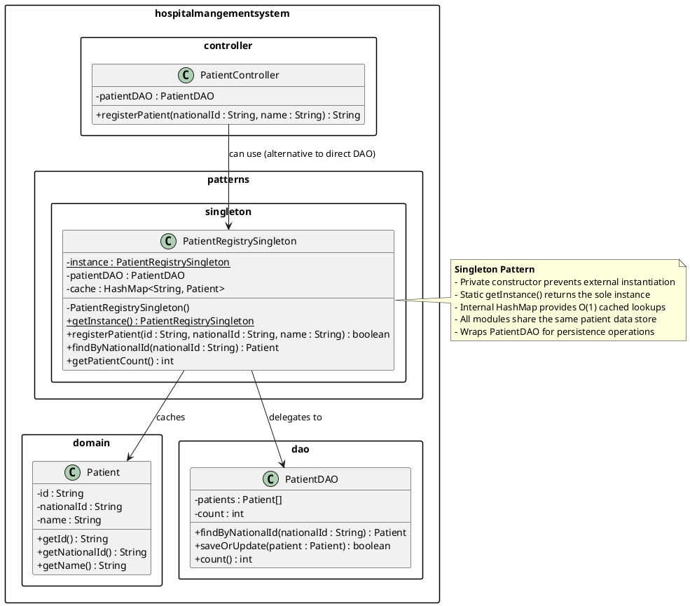
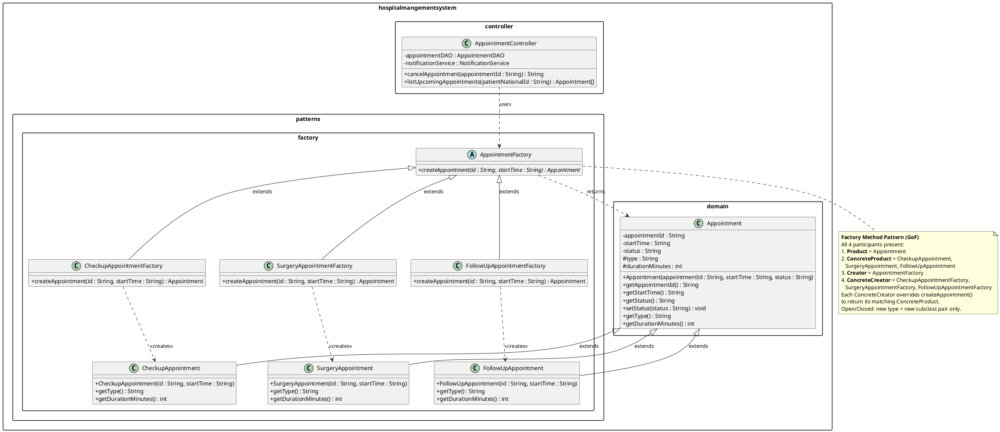

# B3 — UML Class Diagrams for Andrew's Pattern Cases

All diagrams are provided in PlantUML notation for reproducibility.
Export each diagram using any PlantUML renderer (e.g., plantuml.com, StarUML PlantUML plugin, or VS Code PlantUML extension).

---

## 1. Singleton Case #1 — NotificationServiceSingleton

### Rationale
The `NotificationServiceSingleton` wraps the existing `NotificationService` interface and guarantees a single, globally accessible instance. It delegates all notification operations to a concrete `SimpleNotificationService`. Double-checked locking with a `volatile` field is used for thread-safe lazy initialization.

### PlantUML Diagram

---

## 2. Singleton Case #2 — PatientRegistrySingleton

### Rationale
The `PatientRegistrySingleton` provides a single, globally accessible patient registry that wraps the `PatientDAO`. It adds a `HashMap` cache for O(1) lookups by national ID, ensuring all modules read from and write to the same patient store.

### PlantUML Diagram

---

## 3. Factory Method — AppointmentFactory

### Rationale
The diagram models all **four GoF Factory Method participants**:

1. **Product** — `Appointment` (existing domain class, serves as the abstract product base with `protected` fields `type` and `durationMinutes`).
2. **ConcreteProduct** — `CheckupAppointment`, `SurgeryAppointment`, `FollowUpAppointment` (each extends `Appointment` and hardcodes type-specific defaults: duration, initial status).
3. **Creator** — `AppointmentFactory` (abstract class declaring `createAppointment(id, startTime) : Appointment`).
4. **ConcreteCreator** — `CheckupAppointmentFactory`, `SurgeryAppointmentFactory`, `FollowUpAppointmentFactory` (each overrides `createAppointment()` to instantiate its paired ConcreteProduct).

Each ConcreteCreator is paired 1-to-1 with a ConcreteProduct. The client (`AppointmentController`) programs against the abstract `AppointmentFactory` and abstract `Appointment` — it never references a concrete subtype. Adding a new appointment type (e.g., `TelemedicineAppointment`) requires only a new ConcreteProduct + ConcreteCreator pair with zero changes to existing code, satisfying the Open/Closed Principle.

### PlantUML Diagram

---

## Summary Table

| Diagram | Pattern | Package | Key Classes |
|---------|---------|---------|-------------|
| Singleton #1 | Singleton | `patterns.singleton` | `NotificationServiceSingleton` |
| Singleton #2 | Singleton | `patterns.singleton` | `PatientRegistrySingleton` |
| Factory Method | Factory Method | `patterns.factory` | **Creators**: `AppointmentFactory`, `CheckupAppointmentFactory`, `SurgeryAppointmentFactory`, `FollowUpAppointmentFactory`; **Products**: `Appointment` (base, in `domain`), `CheckupAppointment`, `SurgeryAppointment`, `FollowUpAppointment` |

All three diagrams are self-contained and do not overlap with Adham's Abstract Factory UMLs (which target `patterns.abstractfactory`).
