# A4 — Abstract Factory Case #1: ReportAbstractFactory

**Owner:** Adham  
**Pattern:** Abstract Factory (GoF Creational)  
**Case:** Report Generation Family  
**Output:** UML Class Diagram + Rationale

---

## Problem Statement

The Hospital Management System needs to generate various reports for different stakeholders:
- **Administrators** need PDF reports for archival and email distribution
- **Analysts** need CSV exports for data processing in Excel/Python
- **Patients** need HTML summaries viewable in web browsers

Currently, the codebase has no unified way to create these report formats. Each time a new report type is needed, developers must:
1. Choose a specific format class (e.g., `PDFReportGenerator`)
2. Hard-code format-specific logic in controllers
3. Modify existing code when adding new formats (violating Open/Closed Principle)

This creates tight coupling between report consumers and concrete format implementations.

---

## Why Abstract Factory Pattern

The Abstract Factory pattern provides an interface for creating families of related objects without specifying their concrete classes (Gamma et al., 1994).

**Key Benefits for This Problem:**

| Criterion | Rationale |
|-----------|-----------|
| **Family of Related Products** | Reports have related components: ReportDocument, ReportHeader, ReportFooter, ChartComponent. Each format (PDF/CSV/HTML) provides a complete family of these components. |
| **Decoupling** | Controllers depend only on abstract `ReportFactory` and abstract product interfaces, not concrete PDF/CSV/HTML classes. |
| **Consistency** | A PDF factory always produces PDF-compatible components. Mixing PDF headers with CSV footers is impossible by design. |
| **Extensibility** | Adding a new format (e.g., Excel/XLSX) requires only a new factory subclass + product implementations—zero changes to existing code. |
| **Runtime Selection** | The appropriate factory is selected at runtime based on user preference or system configuration. |

**Alternative Rejected — Simple Factory:**
A Simple Factory with if/else for format selection would centralize creation logic but still require modification when adding formats. It also doesn't enforce family consistency—nothing prevents mixing incompatible components.

**Alternative Rejected — Builder Pattern:**
Builder constructs complex objects step-by-step but doesn't address creating families of related objects. It's better for single complex objects, not interchangeable product families.

---

## GoF Participants

### Abstract Factory
- `ReportFactory` (interface)
  - `createReportDocument(): ReportDocument`
  - `createReportHeader(): ReportHeader`
  - `createReportFooter(): ReportFooter`
  - `createChart(): ChartComponent`

### Concrete Factories
- `PDFReportFactory` — creates PDF-compatible components
- `CSVReportFactory` — creates CSV-compatible components
- `HTMLReportFactory` — creates HTML-compatible components

### Abstract Products
- `ReportDocument` — interface for report body/content
- `ReportHeader` — interface for report headers
- `ReportFooter` — interface for report footers
- `ChartComponent` — interface for charts/visualizations

### Concrete Products (per factory)

**PDF Family:**
- `PDFReportDocument implements ReportDocument`
- `PDFReportHeader implements ReportHeader`
- `PDFReportFooter implements ReportFooter`
- `PDFChartComponent implements ChartComponent`

**CSV Family:**
- `CSVReportDocument implements ReportDocument`
- `CSVReportHeader implements ReportHeader`
- `CSVReportFooter implements ReportFooter`
- `CSVChartComponent implements ChartComponent`

**HTML Family:**
- `HTMLReportDocument implements ReportDocument`
- `HTMLReportHeader implements ReportHeader`
- `HTMLReportFooter implements ReportFooter`
- `HTMLChartComponent implements ChartComponent`

### Client
- `ReportController` (uses only abstract factory and product interfaces)

---

## UML Class Diagram (PlantUML)

```plantuml
@startuml AbstractFactory_Case1_ReportFactory

skinparam classAttributeIconSize 0
skinparam packageStyle rectangle

package "hospitalmangementsystem.patterns.abstractfactory" {

    ' ===== ABSTRACT FACTORY =====
    interface ReportFactory {
        + createReportDocument(): ReportDocument
        + createReportHeader(title: String): ReportHeader
        + createReportFooter(pageNum: int): ReportFooter
        + createChart(data: double[]): ChartComponent
    }

    ' ===== CONCRETE FACTORIES =====
    class PDFReportFactory implements ReportFactory {
        + createReportDocument(): ReportDocument
        + createReportHeader(title: String): ReportHeader
        + createReportFooter(pageNum: int): ReportFooter
        + createChart(data: double[]): ChartComponent
    }

    class CSVReportFactory implements ReportFactory {
        + createReportDocument(): ReportDocument
        + createReportHeader(title: String): ReportHeader
        + createReportFooter(pageNum: int): ReportFooter
        + createChart(data: double[]): ChartComponent
    }

    class HTMLReportFactory implements ReportFactory {
        + createReportDocument(): ReportDocument
        + createReportHeader(title: String): ReportHeader
        + createReportFooter(pageNum: int): ReportFooter
        + createChart(data: double[]): ChartComponent
    }

    ' ===== ABSTRACT PRODUCTS =====
    interface ReportDocument {
        + addSection(title: String, content: String): void
        + generate(): byte[]
    }

    interface ReportHeader {
        + setTitle(title: String): void
        + render(): String
    }

    interface ReportFooter {
        + setPageNumber(n: int): void
        + render(): String
    }

    interface ChartComponent {
        + setData(values: double[]): void
        + render(): String
    }

    ' ===== PDF PRODUCT FAMILY =====
    class PDFReportDocument implements ReportDocument {
        - sections: List<String>
        + addSection(title: String, content: String): void
        + generate(): byte[]
    }

    class PDFReportHeader implements ReportHeader {
        - title: String
        + setTitle(title: String): void
        + render(): String
    }

    class PDFReportFooter implements ReportFooter {
        - pageNumber: int
        + setPageNumber(n: int): void
        + render(): String
    }

    class PDFChartComponent implements ChartComponent {
        - data: double[]
        + setData(values: double[]): void
        + render(): String
    }

    ' ===== CSV PRODUCT FAMILY =====
    class CSVReportDocument implements ReportDocument {
        - rows: List<String[]>
        + addSection(title: String, content: String): void
        + generate(): byte[]
    }

    class CSVReportHeader implements ReportHeader {
        - title: String
        + setTitle(title: String): void
        + render(): String
    }

    class CSVReportFooter implements ReportFooter {
        - rowCount: int
        + setPageNumber(n: int): void
        + render(): String
    }

    class CSVChartComponent implements ChartComponent {
        - data: double[]
        + setData(values: double[]): void
        + render(): String
    }

    ' ===== HTML PRODUCT FAMILY =====
    class HTMLReportDocument implements ReportDocument {
        - htmlContent: StringBuilder
        + addSection(title: String, content: String): void
        + generate(): byte[]
    }

    class HTMLReportHeader implements ReportHeader {
        - title: String
        + setTitle(title: String): void
        + render(): String
    }

    class HTMLReportFooter implements ReportFooter {
        - timestamp: String
        + setPageNumber(n: int): void
        + render(): String
    }

    class HTMLChartComponent implements ChartComponent {
        - data: double[]
        + setData(values: double[]): void
        + render(): String
    }
}

package "hospitalmangementsystem.controller" {
    class ReportController {
        - factory: ReportFactory
        + ReportController(factory: ReportFactory)
        + generatePatientReport(patientId: String): byte[]
        + generateAppointmentReport(start: Date, end: Date): byte[]
    }
}

' ===== RELATIONSHIPS =====

' Factories create their product families
PDFReportFactory ..> PDFReportDocument : "<<creates>>"
PDFReportFactory ..> PDFReportHeader : "<<creates>>"
PDFReportFactory ..> PDFReportFooter : "<<creates>>"
PDFReportFactory ..> PDFChartComponent : "<<creates>>"

CSVReportFactory ..> CSVReportDocument : "<<creates>>"
CSVReportFactory ..> CSVReportHeader : "<<creates>>"
CSVReportFactory ..> CSVReportFooter : "<<creates>>"
CSVReportFactory ..> CSVChartComponent : "<<creates>>"

HTMLReportFactory ..> HTMLReportDocument : "<<creates>>"
HTMLReportFactory ..> HTMLReportHeader : "<<creates>>"
HTMLReportFactory ..> HTMLReportFooter : "<<creates>>"
HTMLReportFactory ..> HTMLChartComponent : "<<creates>>"

' Client uses abstract factory
ReportController --> ReportFactory : "uses"
ReportController --> ReportDocument : "uses"
ReportController --> ReportHeader : "uses"
ReportController --> ReportFooter : "uses"
ReportController --> ChartComponent : "uses"

note right of ReportFactory
  **Abstract Factory Pattern**
  Provides interface for creating
  families of related products.
  Each concrete factory creates
  a complete, consistent family.
end note

note right of PDFReportFactory
  **PDF Family**
  All products work together
  to generate PDF reports.
end note

note right of CSVReportFactory
  **CSV Family**
  All products work together
  to generate CSV exports.
end note

note right of HTMLReportFactory
  **HTML Family**
  All products work together
  to generate web-viewable reports.
end note

@enduml
```



---

## Rationale Summary

**Abstract Factory is the precise fit** because:

1. **Product Family Requirement:** Report generation requires multiple cooperating components (document, header, footer, chart) that must be format-consistent. Abstract Factory ensures a PDF factory only produces PDF-compatible parts.

2. **Format Extensibility:** New report formats (Excel, XML, JSON) can be added by creating new factory + product classes without touching existing code—satisfying the Open/Closed Principle.

3. **Runtime Flexibility:** The controller receives the factory at construction time (or via configuration), allowing the same report logic to output different formats without code changes.

4. **Type Safety:** Java's type system enforces that factories return compatible product families. It's impossible to accidentally mix PDF headers with CSV footages.

5. **Testability:** Controllers can be unit-tested with mock factories and mock products, enabling isolated testing without real PDF/CSV generation.

---

## Integration Plan

**Package:** `hospitalmangementsystem.patterns.abstractfactory`

**Insertion Points:**
- `ReportController` constructor accepts `ReportFactory`
- Application wiring in `HospitalMangementSystem.main()` selects factory based on config:
  ```java
  ReportFactory factory = new PDFReportFactory(); // or CSV or HTML
  ReportController reportController = new ReportController(factory);
  ```

**Dependencies:**
- Depends on A2 (cases frozen) ✅
- Depends on A3 (implementation rules) ✅
- No collision with Andrew's work (reports vs notifications/appointments) ✅

---

**Status:** ✅ A4 Complete — UML design + rationale ready for implementation (A6).
