# A5 — Abstract Factory Case #2: UIComponentAbstractFactory

**Owner:** Adham  
**Pattern:** Abstract Factory (GoF Creational)  
**Case:** UI Component Theme Family  
**Output:** UML Class Diagram + Rationale

---

## Problem Statement

The Hospital Management System console UI needs to adapt to different deployment environments:
- **Desktop/Standard Console** — plain text menus with ASCII dividers
- **Web/Cloud Deployment** — HTML-styled output for browser rendering
- **Accessibility Mode** — screen-reader friendly with descriptive labels

Currently, UI classes (like `CancelAppointmentConsoleUI`, `RegisterPatientConsoleUI`) hard-code output formatting. Adding a new display mode requires:
1. Modifying every UI class individually
2. Risking inconsistent formatting across screens
3. Breaking existing modes when adding features

This creates rigid, unmaintainable UI code that cannot adapt to different environments.

---

## Why Abstract Factory Pattern

The Abstract Factory pattern creates families of related objects without specifying concrete classes—perfect for UI theming where all components must share a consistent visual style.

**Key Benefits for This Problem:**

| Criterion | Rationale |
|-----------|-----------|
| **Consistent Look & Feel** | All UI components from the same factory share formatting conventions. Desktop factory uses ASCII dividers; Web factory uses HTML tags; Accessibility uses descriptive text. |
| **Environment Adaptation** | The application selects the appropriate factory at startup based on deployment context (desktop vs web). |
| **Zero UI Class Changes** | UI controllers depend only on abstract components. Adding a new theme requires only new factory + product classes. |
| **Family Coherence** | Impossible to accidentally mix desktop dividers with HTML tags—each factory produces a complete, consistent family. |
| **Testability** | UI logic can be tested with mock factories that capture output strings, no actual console needed. |

**Alternative Rejected — Strategy Pattern:**
Strategy encapsulates interchangeable algorithms but doesn't address creating families of related objects. A Strategy for "formatting" wouldn't ensure headers, footers, and inputs all share the same style.

**Alternative Rejected — Template Method:**
Template Method defines skeleton with subclass steps, but it fixes the structure. Abstract Factory allows completely different component implementations (ASCII vs HTML vs accessible text).

---

## GoF Participants

### Abstract Factory
- `UIComponentFactory` (interface)
  - `createMenu(title: String): MenuComponent`
  - `createInput(label: String): InputComponent`
  - `createButton(label: String): ButtonComponent`
  - `createDivider(): DividerComponent`

### Concrete Factories
- `ConsoleUIFactory` — ASCII/text components for standard terminals
- `WebUIFactory` — HTML-formatted components for browser rendering
- `AccessibleUIFactory` — Screen-reader friendly with full descriptions

### Abstract Products
- `MenuComponent` — displays menu options
- `InputComponent` — captures user input with prompt
- `ButtonComponent` — represents actionable items
- `DividerComponent` — visual separator between sections

### Concrete Products (per factory)

**Console Family:**
- `ConsoleMenu implements MenuComponent` — ASCII borders, numbered options
- `ConsoleInput implements InputComponent` — `Scanner` with text prompt
- `ConsoleButton implements ButtonComponent` — bracketed label `[Submit]`
- `ConsoleDivider implements DividerComponent` — line of dashes `-----------`

**Web Family:**
- `WebMenu implements MenuComponent` — HTML `<ul>` list
- `WebInput implements InputComponent` — HTML `<input>` with label
- `WebButton implements ButtonComponent` — HTML `<button>` element
- `WebDivider implements DividerComponent` — HTML `<hr>` tag

**Accessible Family:**
- `AccessibleMenu implements MenuComponent` — descriptive list with ARIA labels
- `AccessibleInput implements InputComponent` — verbose prompts for screen readers
- `AccessibleButton implements ButtonComponent` — full action descriptions
- `AccessibleDivider implements DividerComponent` — spoken "section end" indicator

### Client
- `PatientUI`, `AppointmentUI` (use only abstract factory and product interfaces)

---

## UML Class Diagram (PlantUML)

```plantuml
@startuml AbstractFactory_Case2_UIComponentFactory

skinparam classAttributeIconSize 0
skinparam packageStyle rectangle

package "hospitalmangementsystem.patterns.abstractfactory.ui" {

    ' ===== ABSTRACT FACTORY =====
    interface UIComponentFactory {
        + createMenu(title: String): MenuComponent
        + createInput(label: String, hint: String): InputComponent
        + createButton(label: String, action: String): ButtonComponent
        + createDivider(): DividerComponent
    }

    ' ===== CONCRETE FACTORIES =====
    class ConsoleUIFactory implements UIComponentFactory {
        + createMenu(title: String): MenuComponent
        + createInput(label: String, hint: String): InputComponent
        + createButton(label: String, action: String): ButtonComponent
        + createDivider(): DividerComponent
    }

    class WebUIFactory implements UIComponentFactory {
        + createMenu(title: String): MenuComponent
        + createInput(label: String, hint: String): InputComponent
        + createButton(label: String, action: String): ButtonComponent
        + createDivider(): DividerComponent
    }

    class AccessibleUIFactory implements UIComponentFactory {
        + createMenu(title: String): MenuComponent
        + createInput(label: String, hint: String): InputComponent
        + createButton(label: String, action: String): ButtonComponent
        + createDivider(): DividerComponent
    }

    ' ===== ABSTRACT PRODUCTS =====
    interface MenuComponent {
        + addOption(key: String, description: String): void
        + render(): String
        + captureSelection(): String
    }

    interface InputComponent {
        + setPrompt(label: String): void
        + setHint(hint: String): void
        + render(): String
        + captureInput(scanner: Scanner): String
    }

    interface ButtonComponent {
        + setLabel(label: String): void
        + setAction(action: String): void
        + render(): String
        + trigger(): void
    }

    interface DividerComponent {
        + render(): String
    }

    ' ===== CONSOLE PRODUCT FAMILY =====
    class ConsoleMenu implements MenuComponent {
        - title: String
        - options: Map<String, String>
        + addOption(key: String, description: String): void
        + render(): String
        + captureSelection(): String
    }

    class ConsoleInput implements InputComponent {
        - label: String
        - hint: String
        + setPrompt(label: String): void
        + setHint(hint: String): void
        + render(): String
        + captureInput(scanner: Scanner): String
    }

    class ConsoleButton implements ButtonComponent {
        - label: String
        - action: String
        + setLabel(label: String): void
        + setAction(action: String): void
        + render(): String
        + trigger(): void
    }

    class ConsoleDivider implements DividerComponent {
        + render(): String
    }

    ' ===== WEB PRODUCT FAMILY =====
    class WebMenu implements MenuComponent {
        - title: String
        - options: List<String>
        + addOption(key: String, description: String): void
        + render(): String
        + captureSelection(): String
    }

    class WebInput implements InputComponent {
        - label: String
        - hint: String
        + setPrompt(label: String): void
        + setHint(hint: String): void
        + render(): String
        + captureInput(scanner: Scanner): String
    }

    class WebButton implements ButtonComponent {
        - label: String
        - action: String
        + setLabel(label: String): void
        + setAction(action: String): void
        + render(): String
        + trigger(): void
    }

    class WebDivider implements DividerComponent {
        + render(): String
    }

    ' ===== ACCESSIBLE PRODUCT FAMILY =====
    class AccessibleMenu implements MenuComponent {
        - title: String
        - options: List<String>
        - ariaLabels: List<String>
        + addOption(key: String, description: String): void
        + render(): String
        + captureSelection(): String
    }

    class AccessibleInput implements InputComponent {
        - label: String
        - hint: String
        - description: String
        + setPrompt(label: String): void
        + setHint(hint: String): void
        + render(): String
        + captureInput(scanner: Scanner): String
    }

    class AccessibleButton implements ButtonComponent {
        - label: String
        - action: String
        - fullDescription: String
        + setLabel(label: String): void
        + setAction(action: String): void
        + render(): String
        + trigger(): void
    }

    class AccessibleDivider implements DividerComponent {
        + render(): String
    }
}

package "hospitalmangementsystem.ui" {
    class PatientUI {
        - uiFactory: UIComponentFactory
        - scanner: Scanner
        + PatientUI(controller: PatientController, factory: UIComponentFactory)
        + run(scanner: Scanner): void
        - showRegistrationForm(): void
    }

    class AppointmentUI {
        - uiFactory: UIComponentFactory
        - scanner: Scanner
        + AppointmentUI(controller: AppointmentController, factory: UIComponentFactory)
        + run(scanner: Scanner): void
        - showCancellationMenu(): void
    }
}

' ===== RELATIONSHIPS =====

' Factories create their product families
ConsoleUIFactory ..> ConsoleMenu : "<<creates>>"
ConsoleUIFactory ..> ConsoleInput : "<<creates>>"
ConsoleUIFactory ..> ConsoleButton : "<<creates>>"
ConsoleUIFactory ..> ConsoleDivider : "<<creates>>"

WebUIFactory ..> WebMenu : "<<creates>>"
WebUIFactory ..> WebInput : "<<creates>>"
WebUIFactory ..> WebButton : "<<creates>>"
WebUIFactory ..> WebDivider : "<<creates>>"

AccessibleUIFactory ..> AccessibleMenu : "<<creates>>"
AccessibleUIFactory ..> AccessibleInput : "<<creates>>"
AccessibleUIFactory ..> AccessibleButton : "<<creates>>"
AccessibleUIFactory ..> AccessibleDivider : "<<creates>>"

' UI classes use abstract factory
PatientUI --> UIComponentFactory : "uses"
PatientUI --> MenuComponent : "uses"
PatientUI --> InputComponent : "uses"

AppointmentUI --> UIComponentFactory : "uses"
AppointmentUI --> MenuComponent : "uses"
AppointmentUI --> InputComponent : "uses"
AppointmentUI --> ButtonComponent : "uses"

note right of UIComponentFactory
  **Abstract Factory Pattern**
  Creates families of related
  UI components. Each factory
  produces a complete, consistent
  UI theme (Console/Web/Accessible).
end note

note right of ConsoleUIFactory
  **Console Theme**
  ASCII dividers, bracketed buttons,
  plain text prompts for terminal UI.
end note

note right of WebUIFactory
  **Web Theme**
  HTML tags for browser rendering,
  semantic markup, styled output.
end note

note right of AccessibleUIFactory
  **Accessible Theme**
  Screen-reader friendly with
  full descriptions and ARIA labels.
end note

@enduml
```



---

## Rationale Summary

**Abstract Factory is the precise fit** because:

1. **UI Family Consistency:** A UI theme requires multiple cooperating components (menu, input, button, divider) that must share formatting style. Abstract Factory ensures Console factory only produces ASCII-compatible parts.

2. **Environment Portability:** The same application logic can render to terminal (console), browser (web), or screen reader (accessible) simply by swapping the factory at startup.

3. **No UI Class Modification:** PatientUI and AppointmentUI depend only on abstract interfaces. Adding a "Mobile" theme requires only new factory + product classes—zero changes to existing UI code.

4. **Cross-Cutting Pattern:** Unlike Singleton or Factory Method which target specific functional problems, this Abstract Factory addresses cross-cutting UI concerns—a distinctly different application of the pattern.

5. **Complete Separation:** UI logic (what to ask) is separated from presentation (how to display), enabling independent evolution of both.

---

## Integration Plan

**Package:** `hospitalmangementsystem.patterns.abstractfactory.ui`

**Insertion Points:**
- `PatientUI` and `AppointmentUI` constructors accept `UIComponentFactory`
- Application wiring in `HospitalMangementSystem.main()` selects factory based on config:
  ```java
  UIComponentFactory uiFactory = new ConsoleUIFactory(); // or Web or Accessible
  PatientUI patientUI = new PatientUI(patientController, uiFactory);
  ```

**Dependencies:**
- Depends on A2 (cases frozen) ✅
- Depends on A3 (implementation rules) ✅
- No collision with ReportAbstractFactory (UI vs Report domains are separate) ✅
- No collision with Andrew's patterns (UI is a new cross-cutting concern) ✅

---

## Differentiation from Case #1

| Aspect | Case #1: ReportAbstractFactory | Case #2: UIComponentAbstractFactory |
|--------|----------------------------------|-------------------------------------|
| **Domain** | Backend report generation | Frontend UI presentation |
| **Product Types** | Document, Header, Footer, Chart | Menu, Input, Button, Divider |
| **Client** | ReportController | PatientUI, AppointmentUI |
| **Variation Axis** | Output format (PDF/CSV/HTML) | Display environment (Console/Web/Accessible) |
| **Pattern Purpose** | Data export flexibility | UI theming and accessibility |

These two cases demonstrate Abstract Factory's versatility across completely different problem domains—proving deep understanding of the pattern.

---

**Status:** ✅ A5 Complete — UML design + rationale ready for implementation (A6).
