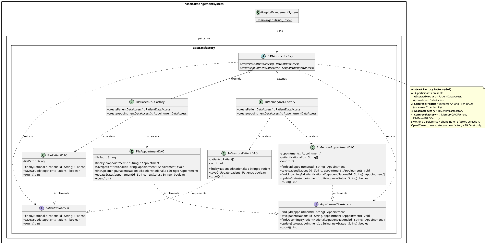

```plantuml
@startuml AbstractFactory_Case1_MedicalDocumentAbstractFactory

skinparam classAttributeIconSize 0
skinparam packageStyle rectangle

' ===== ABSTRACT PRODUCTS =====

package "hospitalmangementsystem.patterns.abstractfactory" {

    interface DischargeSummaryDocument {
        + generate(patientName : String, diagnosis : String, treatmentSummary : String) : void
        + getContent() : String
        + getFormatType() : String
    }

    interface PrescriptionDocument {
        + generate(patientName : String, medication : String, dosage : String) : void
        + getContent() : String
        + getFormatType() : String
    }

    interface MedicalRecordDocument {
        + generate(patientName : String, visitDate : String, notes : String) : void
        + getContent() : String
        + getFormatType() : String
    }

' ===== CONCRETE PRODUCTS — Clinical Family =====

    class ClinicalDischargeSummary {
        - content : String
        + generate(patientName : String, diagnosis : String, treatmentSummary : String) : void
        + getContent() : String
        + getFormatType() : String
    }

    class ClinicalPrescription {
        - content : String
        + generate(patientName : String, medication : String, dosage : String) : void
        + getContent() : String
        + getFormatType() : String
    }

    class ClinicalMedicalRecord {
        - content : String
        + generate(patientName : String, visitDate : String, notes : String) : void
        + getContent() : String
        + getFormatType() : String
    }

' ===== CONCRETE PRODUCTS — Administrative Family =====

    class AdministrativeDischargeSummary {
        - content : String
        + generate(patientName : String, diagnosis : String, treatmentSummary : String) : void
        + getContent() : String
        + getFormatType() : String
    }

    class AdministrativePrescription {
        - content : String
        + generate(patientName : String, medication : String, dosage : String) : void
        + getContent() : String
        + getFormatType() : String
    }

    class AdministrativeMedicalRecord {
        - content : String
        + generate(patientName : String, visitDate : String, notes : String) : void
        + getContent() : String
        + getFormatType() : String
    }

' ===== ABSTRACT FACTORY =====

    abstract class MedicalDocumentAbstractFactory {
        + {abstract} createDischargeSummary() : DischargeSummaryDocument
        + {abstract} createPrescription() : PrescriptionDocument
        + {abstract} createMedicalRecord() : MedicalRecordDocument
    }

' ===== CONCRETE FACTORIES =====

    class ClinicalDocumentFactory {
        + createDischargeSummary() : DischargeSummaryDocument
        + createPrescription() : PrescriptionDocument
        + createMedicalRecord() : MedicalRecordDocument
    }

    class AdministrativeDocumentFactory {
        + createDischargeSummary() : DischargeSummaryDocument
        + createPrescription() : PrescriptionDocument
        + createMedicalRecord() : MedicalRecordDocument
    }
}

package "hospitalmangementsystem.ui" {
    class MedicalDocumentConsoleUI {
        - factory : MedicalDocumentAbstractFactory
        + MedicalDocumentConsoleUI(factory : MedicalDocumentAbstractFactory)
        + run(scanner : Scanner) : void
    }
}

' ===== RELATIONSHIPS =====

' Concrete Products implement Abstract Products
ClinicalDischargeSummary ..|> DischargeSummaryDocument : implements
AdministrativeDischargeSummary ..|> DischargeSummaryDocument : implements

ClinicalPrescription ..|> PrescriptionDocument : implements
AdministrativePrescription ..|> PrescriptionDocument : implements

ClinicalMedicalRecord ..|> MedicalRecordDocument : implements
AdministrativeMedicalRecord ..|> MedicalRecordDocument : implements

' Concrete Factories extend Abstract Factory
MedicalDocumentAbstractFactory <|-- ClinicalDocumentFactory : extends
MedicalDocumentAbstractFactory <|-- AdministrativeDocumentFactory : extends

' Each Concrete Factory creates its family of Concrete Products
ClinicalDocumentFactory ..> ClinicalDischargeSummary : "<<creates>>"
ClinicalDocumentFactory ..> ClinicalPrescription : "<<creates>>"
ClinicalDocumentFactory ..> ClinicalMedicalRecord : "<<creates>>"

AdministrativeDocumentFactory ..> AdministrativeDischargeSummary : "<<creates>>"
AdministrativeDocumentFactory ..> AdministrativePrescription : "<<creates>>"
AdministrativeDocumentFactory ..> AdministrativeMedicalRecord : "<<creates>>"

' Abstract Factory returns Abstract Product types
MedicalDocumentAbstractFactory ..> DischargeSummaryDocument : "returns"
MedicalDocumentAbstractFactory ..> PrescriptionDocument : "returns"
MedicalDocumentAbstractFactory ..> MedicalRecordDocument : "returns"

' Client depends on Abstract Factory
MedicalDocumentConsoleUI --> MedicalDocumentAbstractFactory : "uses"

note bottom of MedicalDocumentAbstractFactory
  **Abstract Factory Pattern (GoF)**
  All 4 participants present:
  1. **AbstractProduct** = DischargeSummaryDocument,
     PrescriptionDocument, MedicalRecordDocument
  2. **ConcreteProduct** = Clinical* and Administrative*
     (6 classes, 3 per family)
  3. **AbstractFactory** = MedicalDocumentAbstractFactory
  4. **ConcreteFactory** = ClinicalDocumentFactory,
     AdministrativeDocumentFactory
  Each ConcreteFactory produces a complete, consistent
  family of three documents.
  Open/Closed: new context = new factory + 3 products only.
end note

@enduml
```

# M — UML Class Diagrams for Maged's Abstract Factory Cases

All diagrams are provided in PlantUML notation for reproducibility.
Export each diagram using any PlantUML renderer (e.g., plantuml.com, StarUML PlantUML plugin, or VS Code PlantUML extension).

---

## 1. Abstract Factory Case #1 — MedicalDocumentAbstractFactory

### Rationale
The diagram models all **four GoF Abstract Factory participants**:

1. **AbstractProduct** — `DischargeSummaryDocument`, `PrescriptionDocument`, `MedicalRecordDocument` (three interfaces declaring the contract for each document type).
2. **ConcreteProduct** — Six concrete classes, three per family: `ClinicalDischargeSummary`, `ClinicalPrescription`, `ClinicalMedicalRecord` (Clinical family) and `AdministrativeDischargeSummary`, `AdministrativePrescription`, `AdministrativeMedicalRecord` (Administrative family).
3. **AbstractFactory** — `MedicalDocumentAbstractFactory` (abstract class declaring three factory methods, one per product type).
4. **ConcreteFactory** — `ClinicalDocumentFactory`, `AdministrativeDocumentFactory` (each overrides all three factory methods to produce its family's ConcreteProducts).

The client (`MedicalDocumentConsoleUI`) programs against the abstract factory and abstract product interfaces — it never references a concrete class. Adding a new document context (e.g., `ResearchDocumentFactory` for anonymized research exports) requires only a new ConcreteFactory and three new ConcreteProducts, with zero changes to existing code (Open/Closed Principle).

### PlantUML Diagram

---

## 2. Abstract Factory Case #2 — DAOAbstractFactory

### Rationale
The diagram models all **four GoF Abstract Factory participants** for the persistence layer:

1. **AbstractProduct** — `PatientDataAccess`, `AppointmentDataAccess` (interfaces abstracting the DAO contracts).
2. **ConcreteProduct** — `InMemoryPatientDAO`, `InMemoryAppointmentDAO` (in-memory family) and `FilePatientDAO`, `FileAppointmentDAO` (file-based family).
3. **AbstractFactory** — `DAOAbstractFactory` (abstract class declaring factory methods for each DAO type).
4. **ConcreteFactory** — `InMemoryDAOFactory`, `FileBasedDAOFactory` (each creates a consistent family of DAOs sharing the same persistence strategy).

The main class selects a factory at startup and obtains all DAOs from it. Switching persistence requires changing one line (the factory selection), not every DAO instantiation.

### PlantUML Diagram

---

## Summary Table

| Diagram | Pattern | Package | Key Classes |
|---------|---------|---------|-------------|
| Abstract Factory #1 | Abstract Factory | `patterns.abstractfactory` | **AbstractFactory**: `MedicalDocumentAbstractFactory`; **ConcreteFactories**: `ClinicalDocumentFactory`, `AdministrativeDocumentFactory`; **AbstractProducts**: `DischargeSummaryDocument`, `PrescriptionDocument`, `MedicalRecordDocument`; **ConcreteProducts**: 6 classes (3 per family) |
| Abstract Factory #2 | Abstract Factory | `patterns.abstractfactory` | **AbstractFactory**: `DAOAbstractFactory`; **ConcreteFactories**: `InMemoryDAOFactory`, `FileBasedDAOFactory`; **AbstractProducts**: `PatientDataAccess`, `AppointmentDataAccess`; **ConcreteProducts**: 4 classes (2 per family) |

Both diagrams are self-contained and do not overlap with Andrew's Singleton/Factory Method UMLs (under `patterns.singleton` and `patterns.factory`) or Adham's Abstract Factory UMLs (which target report families and UI component families).
